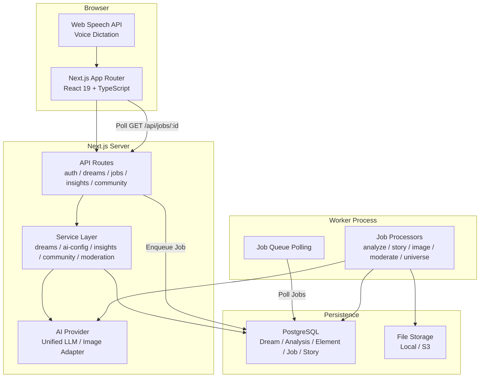
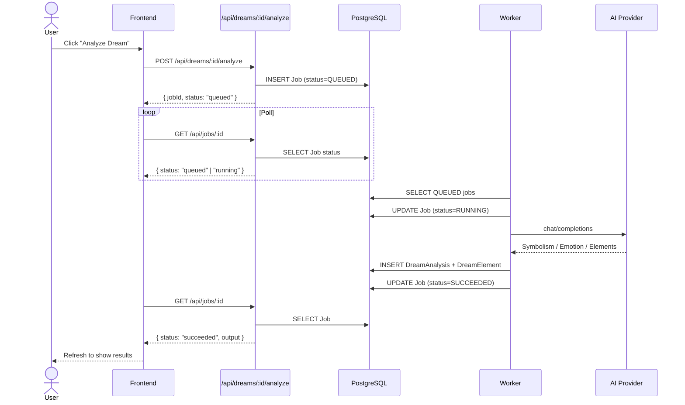
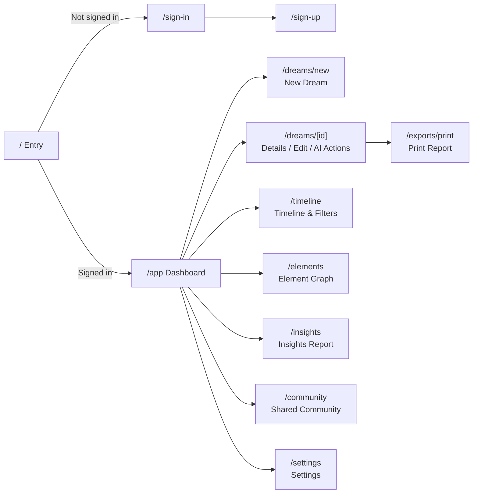

<h1 align="center">DreamSpirit</h1>

<p align="center">
  <b>AI-powered dream journaling, deep analysis & anonymous sharing</b>
</p>

<p align="center">
  
  
  
  
  
  
</p>

<p align="center">
  <a href="README.md">中文</a> ·
  <a href="docs/功能与视觉系统文档.md">Features & UI</a> ·
  <a href="docs/AI-API-说明文档.md">AI Docs</a> ·
  <a href="docs/项目说明文档.md">Project Overview</a> ·
  <a href="docs/DEPLOYMENT.md">Deployment</a> ·
  <a href="docs/RELEASE.md">Release</a>
</p>

---

## What is DreamSpirit

Dreams fade fast after waking up. DreamSpirit helps you capture those fragments before they vanish. Type or speak your dream, then let AI handle the rest — symbol decoding, emotion analysis, story generation, even visual imagery. Over time, element graphs and insight reports reveal the recurring patterns woven across your dream life.

What started as a simple recording tool is now a full-stack **Next.js application**: account system, persistent database, async job queue, per-user AI configuration, browser-based voice dictation, element relationship graphs, thematic insights, anonymous share moderation, collective universe stories, plus Markdown export and PDF printing — all in one locally runnable package.

```bash
git clone https://github.com/Xavier-Trump/DreamSpirit.git && cd DreamSpirit
npm install && docker compose up -d
npx prisma db push && npm run prisma:seed
npm run dev
```

> Open `http://localhost:3000` — demo account: `dreamer@dreamspirit.local` / `dreamspirit123`

## Features

### Journaling

| Feature | Details |
|---|---|
| Rich text editor | TipTap with formatting, lists, and paragraphs |
| Voice dictation | Browser Web Speech API — Chinese Mandarin, Cantonese, English; no backend AI key required |
| Structured fields | Dream date, multi-select + custom emotion tags, clarity 1-5 stars, recurring dream marker, real-life connection notes |
| Draft protection | Auto-save every 15 seconds on the edit page |

### AI Analysis

| Capability | Description |
|---|---|
| Symbolism | Interpret symbolic meaning and latent messages |
| Emotion analysis | Identify emotional states and their sources |
| Stress factors | Surface potential stressors |
| Theme tags | Auto-generate tags for search and insight aggregation |
| Pattern signals | Flag recurring dream patterns |
| Element extraction | Extract characters, locations, objects, and actions for the graph database |

### Creative Output

| Type | Description |
|---|---|
| Story generation | 300–500 word short story or poetic prose per dream |
| Image generation | Generate a representative dream image; base64 local fallback supported |

### Observation & Analysis

| Module | Description |
|---|---|
| Timeline | Browse by date groups; filter by date range, emotion, clarity |
| Element graph | Interactive SVG: node size = occurrence frequency, edge weight = co-occurrence count; hover, click, and keyboard navigation |
| Insights report | Top themes, emotion distribution, theme comparison (custom rules), stress patterns, recording tips |

### Community & Sharing

| Feature | Description |
|---|---|
| Anonymous sharing | Local rule-based moderation runs before a dream enters the shared pool |
| Privacy redaction | Auto-mask emails, phone numbers, ID numbers, URLs, QQ/WeChat handles |
| Content moderation | Illegal, violent, privacy-violating, or spam content is rejected or flagged for review |
| Dream universe | Pick 3–5 shared dreams; AI generates a 1800–2500 word collective story |

### Export & Settings

| Feature | Description |
|---|---|
| Markdown export | Download all dream journals as a single Markdown file |
| Print to PDF | Dedicated print report page, save as PDF via browser |
| AI config | Per-user independent Provider / Key / Model / Endpoint; never exposed to the frontend |
| Preferences | Custom emotion tags and theme rules; add/remove at will |

## Installation

### Prerequisites

- **Node.js** ≥ 18
- **Docker Desktop** (recommended) or a local PostgreSQL 17+ instance
- 2 GB+ free disk space (dependencies + seed data)

### 1. Clone

```bash
git clone https://github.com/Xavier-Trump/DreamSpirit.git
cd DreamSpirit
npm install
```

### 2. Environment

```bash
cp .env.example .env.local
```

Key variables in `.env.local`:

| Variable | Required | Description |
|---|---|---|
| `DATABASE_URL` | Yes | PostgreSQL connection string; local Docker default is fine |
| `AUTH_SECRET` | Yes | Auth encryption secret; dev default ok for local use |
| `AUTH_URL` | Yes | `http://localhost:3000` for local |
| `DOUBAO_API_KEY` | No | Leave blank and fill in via Settings after launch |
| `DOUBAO_CHAT_MODEL` | No | Chat/analysis model ID |
| `DOUBAO_IMAGE_MODEL` | No | Image generation model ID |
| `DOUBAO_ENDPOINT` | No | Chat API endpoint |
| `DOUBAO_IMAGE_ENDPOINT` | No | Image API endpoint |
| `STORAGE_MODE` | No | `local` (default), or `s3` |
| `DEMO_MODE` | No | `false` allows normal registration and writes |

> **Priority:** per-user Settings config > `.env.local` environment variables. Each user can use their own API key.

### 3. Start Database

```bash
docker compose up -d
```

If not using Docker, install PostgreSQL separately and point `DATABASE_URL` to it.

### 4. Initialize Database

```bash
npx prisma db push         # sync schema
npm run prisma:seed         # load demo data
```

Seed data includes: a demo account, multiple dream records, AI analysis results, sample elements, shared dreams, and one universe story.

### 5. Launch

```bash
# Terminal 1: Web server
npm run dev

# Terminal 2: Async job worker
npm run worker
```

Dev mode supports hot reload. For production, run `npm run build` then `npm run start`.

### Docker Production Deployment

The repository includes a reusable Docker production baseline:

```bash
cp .env.production.example .env.production
docker compose --env-file .env.production -f docker-compose.prod.yml up -d --build
```

For production, set `AUTH_URL` to your public HTTPS domain. Keep reverse proxy,
private network addresses, and access-control details in private operations
notes, not in the public repository.

See:

- [Deployment Runbook](docs/DEPLOYMENT.md)
- [Release Process](docs/RELEASE.md)

### Windows Quick Launch

Double-click the script in the project root:

```
start-preview.bat
```

It guides you through:

- **Quick Start** (daily use): reuses existing database and build for fastest startup.
- **Initialize / Repair** (first run / fix): syncs database, loads seed data, rebuilds.
- Local offline / LAN access / tunnel mode.

## Architecture

### System Overview



### Job Queue Flow



### Page Structure



### Design Principles

1. **No AI keys on the frontend.** The browser only calls project APIs — real API keys are never decrypted or saved client-side.
2. **Everything through the job queue.** Analysis, story, image, share moderation, and universe generation all go through the `Job` table; the Worker executes them asynchronously and persists results.
3. **Data is durable.** Dreams, analyses, stories, images, elements, share status, moderation records, and job states are all stored in PostgreSQL.
4. **Per-user AI config.** Each user saves their own API key and model settings; environment variables act as the global fallback.
5. **Local-first.** Runs on your machine by default; data lives in your local database with zero cloud dependencies.

### Tech Stack

| Layer | Technology |
|---|---|
| Runtime | Node.js 18+ |
| Framework | Next.js 15 App Router |
| UI | React 19 + TypeScript 5.6 |
| Editor | TipTap 2.x rich text |
| Icons | lucide-react |
| Styling | CSS custom properties, dark glassmorphism, responsive grid, print styles |
| Auth | Auth.js v5 Credentials + bcryptjs |
| ORM | Prisma 5.17 |
| Database | PostgreSQL |
| Validation | zod |
| AI | Server-side unified Provider, default Doubao (Volcano Ark) chat & image endpoints |
| Async jobs | Database-driven Job Queue + Worker polling |
| File storage | Local files (default) / S3-compatible |

### Project Structure

```text
app/              App Router pages & API routes
│  api/           REST endpoints (auth, dreams, jobs, insights, community, settings)
│  sign-in/       Sign-in page
│  sign-up/       Registration page
│  start/         Entry page
components/       UI components (forms, graph, voice dictation, moderation)
│  auth/          Auth-related components
docs/             Project documentation
lib/              Service layer
│  ai/            AI Provider implementation
│  jobs/          Job processors
│  ai-config.ts   AI config reading/writing
│  auth.ts        Auth configuration
│  community.ts   Community & sharing
│  dreams.ts      Dream CRUD
│  insights.ts    Insight aggregation
│  prisma.ts      Prisma client
│  share-moderation.ts  Share moderation & redaction
│  storage.ts     File storage
│  utils.ts       Utility functions
prisma/           Prisma schema & seed data
public/           Static assets & brand images
types/            TypeScript type extensions
worker/           Background job processor entry
```

### API Reference

#### Account

| Method | Path | Description |
|---|---|---|
| `POST` | `/api/auth/register` | Register |
| `DELETE` | `/api/account` | Delete account |
| `GET` / `PUT` | `/api/settings/ai-config` | AI config read/write |
| `GET` / `PUT` | `/api/settings/dream-preferences` | Emotion tags & theme rules |

#### Dreams

| Method | Path | Description |
|---|---|---|
| `POST` / `GET` | `/api/dreams` | Create / list |
| `GET` / `PATCH` / `DELETE` | `/api/dreams/:id` | Read / update / delete |
| `GET` | `/api/dreams/export` | Full Markdown export |

#### AI Tasks (all return `{ jobId, status }`)

| Method | Path | Description |
|---|---|---|
| `POST` | `/api/dreams/:id/analyze` | Analyze dream |
| `POST` | `/api/dreams/:id/story` | Generate story |
| `POST` | `/api/dreams/:id/image` | Generate image |
| `POST` | `/api/dreams/:id/share` | Submit anonymous share |
| `POST` | `/api/dreams/:id/transcribe` | Transcribe (placeholder) |
| `GET` | `/api/jobs/:id` | Poll job status |

#### Insights & Community

| Method | Path | Description |
|---|---|---|
| `GET` | `/api/insights/summary` | Insight report data |
| `GET` | `/api/community/dreams` | Public shared pool |
| `POST` | `/api/community/universe` | Generate universe story |

### Job Types

| Type | Input | Output |
|---|---|---|
| `ANALYZE_DREAM` | Title, content, emotions, clarity | Symbolism, emotion analysis, stress factors, themes, elements |
| `GENERATE_STORY` | Full dream text | 300–500 word short story |
| `GENERATE_IMAGE` | AI prompt | Image URL or base64 |
| `MODERATE_SHARE` | Raw dream text | Redacted text + moderation verdict |
| `GENERATE_UNIVERSE` | 3–5 public dreams | 1800–2500 word collective story |
| `TRANSCRIBE` | Audio | Currently placeholder |

Failed jobs retry up to 3 times before being marked `FAILED`.

## Usage Modes

| Mode | Access | Scenario |
|---|---|---|
| **Local offline** | `http://localhost:3000` | Daily use, data stays on your machine, no internet needed |
| **LAN** | `http://<your-lan-ip>:3000` | Other devices on the same Wi-Fi |
| **Tunnel** | Temporary tunnel tool | Temporary remote access |

> If LAN access fails, allow Node.js or port `3000` through your firewall.

## Visual Design

DreamSpirit uses a **dark dream-workbench** aesthetic:

- Deep blue-black background (`#08141d`) evokes nighttime and dream atmosphere.
- Orange accent (`#ff8c42`) for primary buttons and key actions.
- Teal secondary accent (`#6dd3ce`) for links, graph, and navigation.
- Semi-transparent dark surfaces, 18px blur, soft borders, large border-radius.
- Single-column layout on mobile; dedicated `@media print` styles for PDF export.

See [Features & Visual System](docs/功能与视觉系统文档.md) for details.

## Documentation

| Document | Content |
|---|---|
| [Project Overview](docs/项目说明文档.md) | Overview, rubric mapping, data flows, innovations, demo script |
| [Features & Visual System](docs/功能与视觉系统文档.md) | Pages, flows, interaction states, color & layout system |
| [AI API Documentation](docs/AI-API-说明文档.md) | Provider config, job queue, moderation, API reference |

## Contributing

```bash
git clone https://github.com/Xavier-Trump/DreamSpirit.git
cd DreamSpirit
npm install
npm run dev
```

Issues and pull requests are welcome.

## License

[MIT](LICENSE)

---

DreamSpirit is an independent, third-party open-source project. Not affiliated with any commercial AI service provider. Intended for personal learning, research, and self-exploration. When using AI features, please comply with the respective provider's API terms of service.
